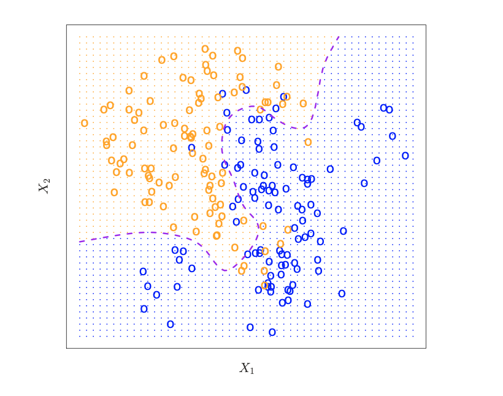
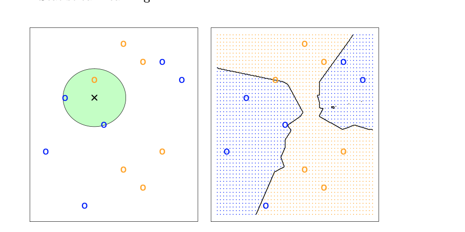

### Linear Models and Least Squares:
### Statistical Decision Theory:
- Assume that we want to find the underlying relationship between an advertising data and the total number of sales
- Assuming independence between the variables, we can develop a statistical model to developor predictor for the total number of sales:
  - Some mode of the form $y= f(X) + \epsilon$
- Assume we develop some arbitary model of the form $\bar{f}(x)$ there are primarily two types of errors:
  - Reducible and irreducible
- Now let's consider the square loss of this predictor:
- $\mathbb{E}[Y - \bar{Y}]^2 = \mathbb{E}[f(X) + \epsilon -\bar{f}(X)]^2$
- With the assumption that $\bar{f}$ and $X$ are fixed, it is clear that we have $f[(x)-\bar{f}(x)]^2$ as reducible error and $var(\epsilon)$ as irreducible
### Inference
- In order to build effective models, one must be able to identify which predictors contribute the most to $Y$
- Understanding the relationship between the predictor and the response is impertiave
- Is the relationship between $Y$ representable in a linear manner 
### Parametric Methods:
- Make assumptions about the dataset
- Stuff like  OLS
### Non-Parametric Methods:
- Doesn't make assumption about data
  - Examples include splines
### Model Intepretability vs Prediction Accuracy:
- Machine learning models often make the tradeoff of interpretability for flexibility 
- Simple models such as OLS are easy to interpret but less flexible, splines and neural networks are harder to interpret
### Regression Versus Classification Problem:
- Use regression for numeric outputs and classification for categorical outputs
### Evaluation Metrics:
In the domain of regression, the most common accuracy metric is $MSE=\frac{1}{n}\sum_{i=1}^n (y_i -\bar{f}(x_i))^2$.  
It is clear that the in the domain of machine learning, we are mostly interested in how well our data generalizes. To evaluate models, we often use a metric such as the mean square error for the test set. 
### Bias Variance Tradeoff:
Assume that squared loss can be decomposed into three componentws:
$\mathbb{E}(y_0 - \bar{f}(x_0))^2 = var(\bar{f}(x_0)) + [Bias(\bar{f}(x_0))]^2 + var(\epsilon)$. It is clear from this equation that in order to minimize this value, one must minimize both bias and variance. Variance is the notion of how a model reacts to a change in datset whereas bias is the error imposed from approximating a real life problem. 
- As a general rule, as one uses more flexible methods there is a greater increase in variance and less bias and more rigid methods have bigger bias but less variance
### Classification Setting
The notion of the bias variance tradeoff often transfers over to the domain of classification despite being categorical variables. Assume that we want to estimate $f$ on some dataset $\mathcal{D}$ it is clear that one could identify the mean training error rate. Using the following equation: $\frac{1}{n}\sum_{i=1}^nI(y_i \neq \bar{y}_i)$.  Assume for $I$ maps onto $0$ if the variables are equal and $1$ otherwise. 
### Bayes Error Classifier:
It is clear that prediction error is minimize when we consider conditional classifier. In other words we minimize $Pr(Y=j|X= x_0) = \frac{Pr(X =x|Y=y)Pr(Y =y)}{Pr(X)}$. For binary classification, it is clear that the problem boils down to choosing the $Pr(Y=j|X=x)>0.5$. 

Note that the purple boundary is called the Bayes error region. 
The Bayes error rate is statisically optimal so in order to maximize bayes classifier one can simply maximize $\max_{j}Pr(Y=y|X=x_0)$. The Bayes error rate or the minimal error rate then can be given as the following:
$1 -\mathbb{E}(\max_j Pr(Y=j|X))$.
### K-nearest neighbors:
In theory, one would ideally like to optimize in terms of the Bayes classifier. However, although this is theoretically optimal, reality often does not follow idealizd situtaions since we often do not know the actual conditional distribution of data. There many heuristics that often utilize some notion of Bayesian infernce. One of them is $KNN$. Given some arbitary dataset $\mathcal{D}$, one estimates conditional probability for something like classification via taking the $k$ nearest points based off of a distance metric and taking the average of these values. 
In essence, we choose the $y$ s.t $Pr(Y=y|X=x_0)=\frac{1}{k}\argmax_{i \in \mathcal{N}}I(y_i =i)$. 

The following exammple clearly shows that KNN produces a classifier that can be very close to an optimal bayes classifier. One problem with KNN is that it varies a lot with choice of $K$. Increasing K reduces variance but at the same time results in increased bias.
